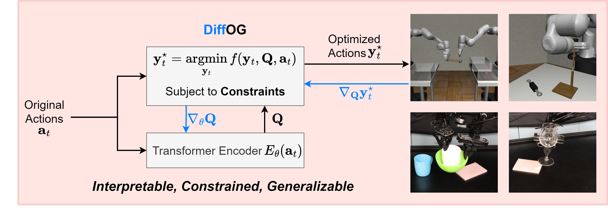

# DiffOG: Differentiable Policy Trajectory Optimization with Generalizability

_Published in IEEE Transactions on Robotics_

[Project](https://zhengtongxu.github.io/diffog-website/) | [arXiv](https://arxiv.org/abs/2504.13807) | [Video](https://drive.google.com/file/d/19vxJWG5CZg6uCrhsZEANto7W33nWLZbl/view)

DiffOG is a transformer-based differentiable trajectory optimization framework that enhances visuomotor policies by refining action trajectories to be smoother and constraint-compliant while maintaining fidelity to the demonstration distribution.



## Installation

```console
$ cd diffog
$ mamba env create -f conda_environment.yaml
$ bash install_third_party.sh
```

The environment also requires MuJoCo. Please refer to the [MuJoCo documentation](https://mujoco.readthedocs.io/en/2.1.3/overview.html) for installation. Make sure to set the following environment variables before running:
```console
$ export LD_LIBRARY_PATH=$LD_LIBRARY_PATH:${HOME}/.mujoco/mujoco210/bin
$ export LD_LIBRARY_PATH=$LD_LIBRARY_PATH:/usr/lib/nvidia
$ export MUJOCO_GL=egl
```

## Dataset

To run DiffOG on [robomimic](https://robomimic.github.io/) tasks, download and extract the data under the `data/` directory:

```console
$ cd diffog
$ wget https://diffusion-policy.cs.columbia.edu/data/training/robomimic_image.zip
$ unzip robomimic_image.zip -d data/
$ rm robomimic_image.zip
```

## Training

Activate the conda environment:
```console
$ conda activate diffogenv
```

All training logs are uploaded to [wandb](https://wandb.ai). Login to wandb (if you haven't already):
```console
$ wandb login
```

### DiffOG Dataset Training

In this mode, supervised learning is performed directly on the demonstration dataset.

For example, train DiffOG on the **Tool Hang** task:
```console
$ python train.py --config-dir=./diffog/config --config-name=train_diffusion_diffog_tool.yaml hydra.run.dir=data/outputs/train_diffusion_diffog_tool
```

### DiffOG Refine Training

In this mode, supervised learning refines the actions generated by a pre-trained base policy. This requires a pretrained base diffusion policy checkpoint. Specify the path to the checkpoint via the `init_path` field in the YAML config before running.

For example, train DiffOG Refine on the **Tool Hang** task:
```console
$ python train.py --config-dir=./diffog/config --config-name=train_diffusion_diffog_tool_res_ddim.yaml hydra.run.dir=data/outputs/train_diffusion_diffog_tool_res_ddim
```

Note that each job needs its own output directory. You don't need to create the folder manually; the system will automatically create a new folder for you when you run the job with a different `hydra.run.dir`.

## Differentiable Optimization Layer

The core differentiable optimization layer is implemented in `diffog/model/diffog_layer.py`. It contains two main components:

- **`DiffogTf`**: The differentiable optimization module that formulates and solves a Quadratic Program to enforce smoothness and feasibility constraints on the predicted action trajectory. It uses a Transformer encoder (`TemporalTransformerEncoder`) to parameterize the learnable cost matrix **Q**, which is constructed as a symmetric positive definite matrix via Cholesky factorization. The QP is solved via [qpth](https://github.com/locuslab/qpth) for differentiable optimization. Key parameters include:
  - `constraint`: the bound on consecutive action differences
  - `smooth_weight`: weight for the smoothness regularization term

- **`TemporalTransformerEncoder`**: A Transformer-based encoder that processes the temporal action sequence and outputs a single embedding vector used to construct the input-dependent **Q** matrix.

The `forward` method enforces inter-step smoothness constraints during training, while `forward_with_past_action` additionally constrains the first predicted action to be close to the most recent executed action, ensuring temporal consistency during inference.

## BibTeX

If you find this codebase useful, consider citing:

```bibtex
@article{xu2025diffog,
  title={DiffOG: Differentiable Policy Trajectory Optimization with Generalizability},
  author={Xu, Zhengtong and Miao, Zichen and Qiu, Qiang and Zhang, Zhe and She, Yu},
  journal={IEEE Transactions on Robotics},
  year={2025},
  publisher={IEEE}
}
```

## Acknowledgement

This repository, during construction, referenced the code structure of [diffusion policy](https://github.com/real-stanford/diffusion_policy). We sincerely thank the authors of diffusion policy for open-sourcing such an elegant codebase!